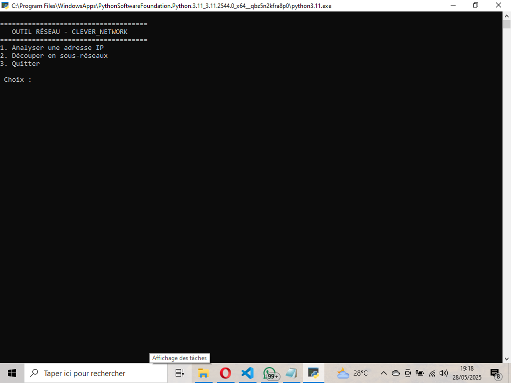
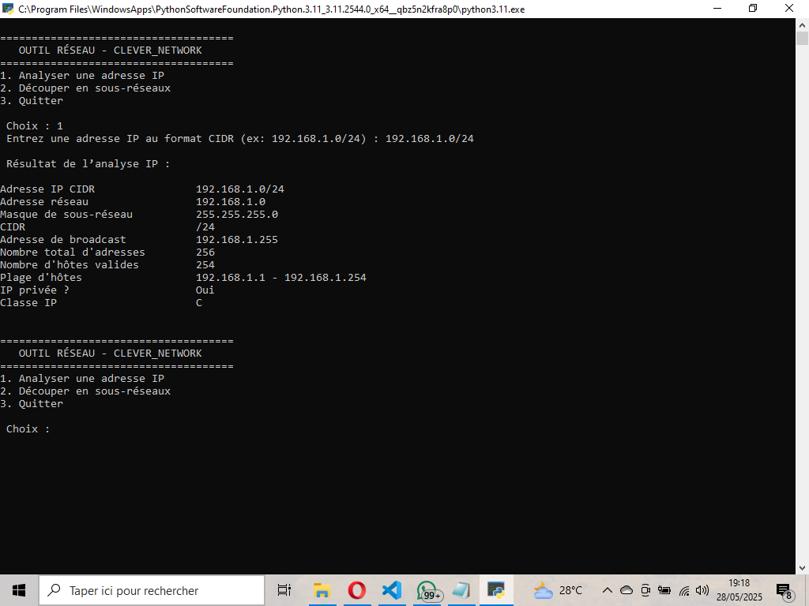

# 🧠 Clever_Network

> Outil intelligent pour simplifier les calculs d’adressage IP – conçu pour les admins réseau, sysadmins et passionnés de cybersécurité.

---

## 🚀 Pourquoi Clever_Network ?

Faire des calculs IP manuellement, c’est long et fastidieux.  
Clever_Network est un outil **100% en Python**, simple et rapide, qui automatise :
- Le calcul du masque de sous-réseau
- L’identification de la plage IP valide
- L'adresse réseau et de diffusion
- Et plus encore…

📍 **Fonctionne totalement hors ligne**  
🧠 **Parfait pour l’apprentissage et les environnements techniques**

---

## ⚙️ Fonctionnalités principales

- ✅ Calculs IP automatiques (IPv4)
- ✅ Conversion entre binaire/décimal
- ✅ Résumé clair de la configuration réseau
- ✅ Interface en ligne de commande intuitive
- ✅ Léger, rapide, sans dépendances externes

---

## 🚀 Démonstraion 




---

## 🔮 Roadmap (extraits)
 Calculs IP IPv4 de base

 Interface graphique (Tkinter ou PyQt)

 Export en PDF/CSV

 API REST pour intégration externe

 Version Web avec Flask

📍 Détails dans 
[Détail_ROADMAP](ROADMAP.md)


## 📦 Installation

```bash
git clone https://github.com/Savio8-Tech/Clever_Network.git
cd Clever_Network
python3 clever_network.py

## 🧪 Exemple d’utilisation


Entrez l’adresse IP (ex: 192.168.1.1) :

--- Résultat ---
Adresse réseau  : 192.168.1.0
Adresse de diff : 192.168.1.255
Plage valide    : 192.168.1.1 - 192.168.1.254
Nombre d’hôtes  : 254

## 🤝 Contribuer

Voulez vous aider à rendre cet outil encore plus puissant ?
[Lisez_le_guide](CONTRIBUTING.md)

## 🛡️ Licence

Distribué sous licence MIT.
📄 Licence : [MIT](./LICENSE)

Voir LICENSE pour plus d’infos.


## 📣 Auteur

Projet initié par AGOUDAVI Kossi Dominique(Savio Clever)

⭐ Si vous trouvez cet outil utile, pensez à mettre une étoile au projet pour le soutenir !